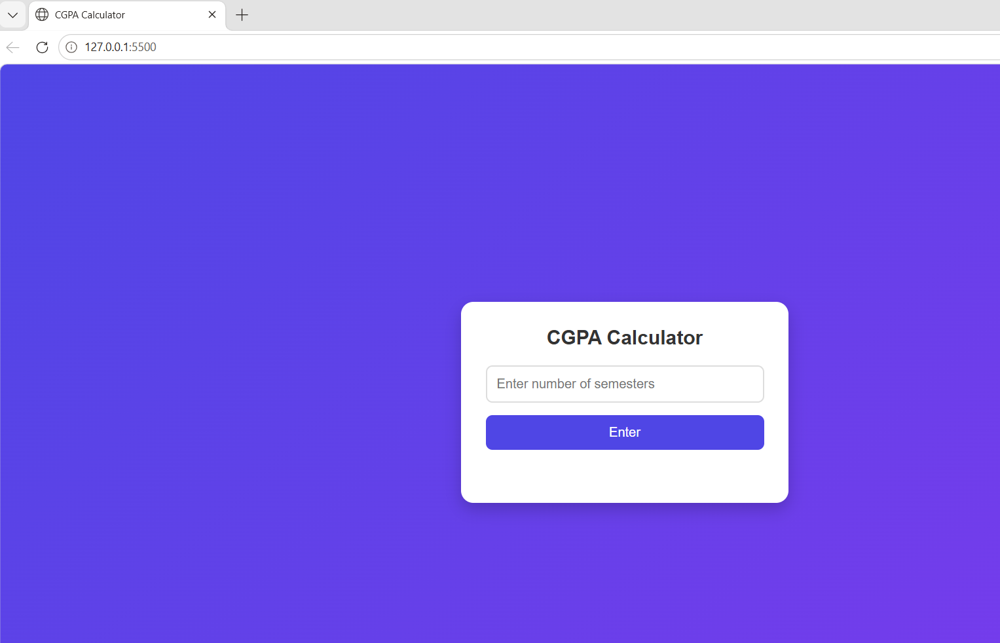
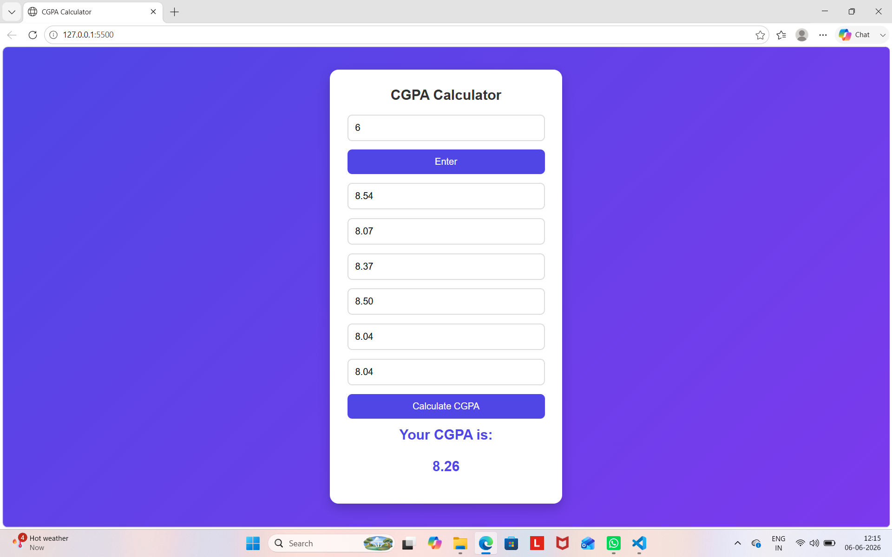

CGPA Calculator

A simple CGPA Calculator built using HTML, CSS, and JavaScript.

Features

- Enter the number of semesters (1–8)
- Input SGPA for each semester
- Calculate overall CGPA instantly
- Simple and responsive user interface

Technologies Used

- HTML
- CSS
- JavaScript

Project Structure

CGPA-Calculator/

- index.html
- CGPA.css
- CGPA.js
- README.md

How to Run

1. Download or clone the repository.
2. Open "index.html" in any web browser.
3. Enter the number of semesters.
4. Enter the SGPA for each semester.
5. Click Calculate CGPA to view the result.

## Screenshots

### Home Page

### Result Page

Example

Semester 1: 8.54
Semester 2: 8.07
Semester 3: 8.37
Semester 4: 8.50
Semester 5: 8.04
Semester 6: 8.04

CGPA: 8.26

Author

Akshaya Ratna